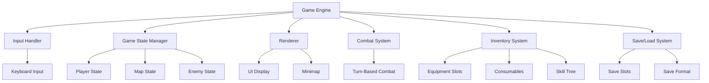

# Design Document: Acolyte - Bash Roguelike Game

## Overview

Acolyte is a terminal-based roguelike dungeon crawler game written in Bash. The game features a 16x16 dungeon map where players explore, combat monsters, collect equipment and items, level up skills, and attempt to reach the exit. The game includes a comprehensive skill tree system, inventory management, save/load functionality, and multiple difficulty levels. This design document provides both high-level architecture and low-level implementation details to guide future feature development.

## Architecture

### System Components



### Data Flow

1. **Input Processing**: Keyboard input is captured and routed to appropriate handlers
2. **State Updates**: Game state is modified based on player actions
3. **Rendering**: UI is redrawn to reflect current state
4. **Combat Resolution**: Turn-based combat resolves damage calculations
5. **Persistence**: Game state can be saved to or loaded from disk

## Components and Interfaces

### Component 1: Game Engine

**Purpose**: Core game loop and coordination between subsystems

**Interface**:
```pascal
PROCEDURE game_init()
  SEQUENCE
    initialize_game_state()
    load_saved_state_if_exists()
    show_intro_screen()
  END SEQUENCE
END PROCEDURE

PROCEDURE game_loop()
  SEQUENCE
    WHILE game_running = true DO
      render_ui()
      input ← read_input()
      process_input(input)
      check_game_over()
    END WHILE
  END SEQUENCE
END PROCEDURE

PROCEDURE game_over()
  SEQUENCE
    show_game_over_screen()
    display_final_stats()
    exit_game()
  END SEQUENCE
END PROCEDURE
```

**Responsibilities**:
- Initialize game state
- Manage main game loop
- Handle game over conditions
- Coordinate subsystems

### Component 2: Input Handler

**Purpose**: Process keyboard input and route to appropriate handlers

**Interface**:
```pascal
TYPE InputKey = ENUM {
  MOVE_UP, MOVE_DOWN, MOVE_LEFT, MOVE_RIGHT,
  INVENTORY, HELP, SAVE, LOAD, QUIT,
  SKILL_1, SKILL_2, SKILL_3, SKILL_4, SKILL_5, SKILL_6,
  USE_POTION, USE_BOMB, TOGGLE_MINIMAP
}

FUNCTION read_input() RETURNS InputKey
FUNCTION parse_key(key: String) RETURNS InputKey
```

**Responsibilities**:
- Capture keyboard input
- Parse key presses into game actions
- Handle both WASD and arrow key mappings

### Component 3: Game State Manager

**Purpose**: Manage all game state including player, map, and enemies

**Interface**:
```pascal
STRUCTURE GameState
  player: PlayerState
  map: MapState
  enemies: Map<String, EnemyState>
  inventory: InventoryState
  game_stats: GameStats
END STRUCTURE

STRUCTURE PlayerState
  position: Position
  hp: Integer
  max_hp: Integer
  attack: Integer
  defense: Integer
  level: Integer
  xp: Integer
  xp_needed: Integer
  gold: Integer
  skills: SkillTree
  equipment: Equipment
  status_effects: Map<String, Integer>
END STRUCTURE

STRUCTURE MapState
  grid: Array[16][16] of TileType
  exit_position: Position
END STRUCTURE

STRUCTURE EnemyState
  type: String
  position: Position
  hp: Integer
  attack: Integer
  defense: Integer
  xp_value: Integer
  gold_value: Integer
  special_ability: String
END STRUCTURE
```

**Responsibilities**:
- Store and update player state
- Manage map state and tile interactions
- Track enemy positions and states
- Handle inventory and equipment

### Component 4: Renderer

**Purpose**: Display game state to terminal

**Interface**:
```pascal
PROCEDURE render_ui()
  SEQUENCE
    clear_screen()
    draw_header()
    draw_status_bar()
    draw_map()
    draw_equipment_bar()
    draw_minimap()
    draw_log()
    draw_footer()
  END SEQUENCE
END PROCEDURE

PROCEDURE draw_map()
  SEQUENCE
    FOR y FROM 0 TO 15 DO
      FOR x FROM 0 TO 15 DO
        tile ← get_tile_at(x, y)
        draw_tile(tile, x, y)
      END FOR
    END FOR
  END SEQUENCE
END PROCEDURE

PROCEDURE draw_tile(tile: TileType, x: Integer, y: Integer)
  SEQUENCE
    color ← get_tile_color(tile)
    symbol ← get_tile_symbol(tile)
    print_at(x, y, color + symbol + NC)
  END SEQUENCE
END PROCEDURE
```

**Responsibilities**:
- Clear and redraw screen
- Render map with appropriate symbols and colors
- Display status bars and UI elements
- Show minimap when enabled

### Component 5: Combat System

**Purpose**: Handle turn-based combat between player and enemies

**Interface**:
```pascal
PROCEDURE combat(enemy: EnemyState)
  SEQUENCE
    WHILE player.hp > 0 AND enemy.hp > 0 DO
      player_turn(enemy)
      IF enemy.hp > 0 THEN
        enemy_turn(enemy)
      END IF
    END WHILE
    resolve_combat_result(enemy)
  END SEQUENCE
END PROCEDURE

PROCEDURE player_turn(enemy: EnemyState)
  SEQUENCE
    damage ← calculate_player_damage()
    IF is_critical_hit() THEN
      damage ← damage * 2
      show_critical_hit_message()
    END IF
    enemy.hp ← enemy.hp - damage
    show_player_attack_message(damage, enemy.hp)
  END SEQUENCE
END PROCEDURE

PROCEDURE enemy_turn(enemy: EnemyState)
  SEQUENCE
    IF player.dodge_roll() < player.dodge_chance THEN
      show_dodge_message()
    ELSE
      damage ← calculate_enemy_damage(enemy)
      player.hp ← player.hp - damage
      show_enemy_attack_message(damage, player.hp)
    END IF
  END SEQUENCE
END PROCEDURE

FUNCTION calculate_player_damage() RETURNS Integer
  SEQUENCE
    base ← player.attack
    weapon_bonus ← get_equipment_attack_bonus()
    variance ← random(0, 3)
    RETURN base + weapon_bonus + variance
  END SEQUENCE
END FUNCTION

FUNCTION calculate_enemy_damage(enemy: EnemyState) RETURNS Integer
  SEQUENCE
    base ← enemy.attack
    defense ← player.defense
    variance ← random(0, 1)
    damage ← base - defense + variance
    IF damage < 1 THEN
      damage ← 1
    END IF
    RETURN damage
  END SEQUENCE
END FUNCTION
```

**Responsibilities**:
- Manage combat turns
- Calculate damage with variance
- Handle special enemy abilities
- Determine combat outcome

### Component 6: Inventory System

**Purpose**: Manage player inventory, equipment, and skill tree

**Interface**:
```pascal
STRUCTURE InventoryState
  potions: Integer
  keys: Integer
  bombs: Integer
  scrolls: Integer
  gold: Integer
END STRUCTURE

STRUCTURE Equipment
  sword: Boolean
  shield: Boolean
  boots: Boolean
  amulet: Boolean
  ring: Boolean
  helm: Boolean
  cape: Boolean
  gloves: Boolean
END STRUCTURE

STRUCTURE SkillTree
  critical_strike: Integer
  dodge: Integer
  treasure_hunter: Integer
  magic: Integer
  stealth: Integer
  vitality: Integer
  skill_points: Integer
END STRUCTURE

PROCEDURE show_inventory()
  SEQUENCE
    clear_screen()
    draw_inventory_header()
    draw_consumables()
    draw_equipment()
    draw_skill_tree()
    draw_inventory_actions()
    handle_inventory_input()
  END SEQUENCE
END PROCEDURE

PROCEDURE equip_item(item: EquipmentSlot)
  SEQUENCE
    IF item = sword AND NOT equipment.sword THEN
      equipment.sword ← true
      player.attack ← player.attack + 3
      show_equip_message("Sword", "+3 Attack")
    END IF
    IF item = shield AND NOT equipment.shield THEN
      equipment.shield ← true
      player.defense ← player.defense + 2
      player.max_hp ← player.max_hp + 5
      show_equip_message("Shield", "+2 DEF, +5 Max HP")
    END IF
    // Similar logic for other equipment
  END SEQUENCE
END PROCEDURE

PROCEDURE upgrade_skill(skill: SkillType)
  SEQUENCE
    IF player.skill_points > 0 THEN
      player.skill_points ← player.skill_points - 1
      CASE skill OF
        critical_strike: player.skills.critical_strike ← player.skills.critical_strike + 1
        dodge: player.skills.dodge ← player.skills.dodge + 1
        treasure_hunter: player.skills.treasure_hunter ← player.skills.treasure_hunter + 1
        magic: player.skills.magic ← player.skills.magic + 1
        stealth: player.skills.stealth ← player.skills.stealth + 1
        vitality: player.skills.vitality ← player.skills.vitality + 1
      END CASE
      show_upgrade_message(skill)
    ELSE
      show_error_message("Not enough skill points")
    END IF
  END SEQUENCE
END PROCEDURE
```

**Responsibilities**:
- Track consumable items
- Manage equipment slots
- Handle skill tree progression
- Apply equipment bonuses

### Component 7: Save/Load System

**Purpose**: Persist and restore game state

**Interface**:
```pascal
CONSTANT SAVE_DIR = "$HOME/.acolyte_saves"
CONSTANT SAVE_FILE_FORMAT = "save_{slot}.dat"

PROCEDURE save_game(slot: Integer)
  SEQUENCE
    save_file ← SAVE_DIR + "/save_" + slot + ".dat"
    CREATE_FILE(save_file)
    WRITE_LINE(save_file, "x=" + player.position.x)
    WRITE_LINE(save_file, "y=" + player.position.y)
    WRITE_LINE(save_file, "hp=" + player.hp)
    WRITE_LINE(save_file, "max_hp=" + player.max_hp)
    WRITE_LINE(save_file, "attack=" + player.attack)
    WRITE_LINE(save_file, "defense=" + player.defense)
    WRITE_LINE(save_file, "level=" + player.level)
    WRITE_LINE(save_file, "xp=" + player.xp)
    WRITE_LINE(save_file, "xp_needed=" + player.xp_needed)
    WRITE_LINE(save_file, "gold=" + player.gold)
    WRITE_LINE(save_file, "potions=" + inventory.potions)
    WRITE_LINE(save_file, "keys=" + inventory.keys)
    WRITE_LINE(save_file, "has_sword=" + equipment.sword)
    WRITE_LINE(save_file, "has_shield=" + equipment.shield)
    // Write all other state variables
    CLOSE_FILE(save_file)
    show_message("Game saved!")
  END SEQUENCE
END PROCEDURE

PROCEDURE load_game(slot: Integer)
  SEQUENCE
    save_file ← SAVE_DIR + "/save_" + slot + ".dat"
    IF FILE_EXISTS(save_file) THEN
      source(save_file)
      show_message("Game loaded from slot " + slot)
    ELSE
      show_error_message("No save file in slot " + slot)
    END IF
  END SEQUENCE
END PROCEDURE
```

**Responsibilities**:
- Save game state to disk
- Load game state from disk
- Support multiple save slots
- Handle save file format

## Data Models

### Model 1: Player State

```pascal
STRUCTURE PlayerState
  position: Position
  hp: Integer
  max_hp: Integer
  attack: Integer
  defense: Integer
  level: Integer
  xp: Integer
  xp_needed: Integer
  gold: Integer
  skills: SkillTree
  equipment: Equipment
  status_effects: Map<String, Integer>
END STRUCTURE

STRUCTURE Position
  x: Integer
  y: Integer
END STRUCTURE

STRUCTURE SkillTree
  critical_strike: Integer
  dodge: Integer
  treasure_hunter: Integer
  magic: Integer
  stealth: Integer
  vitality: Integer
  skill_points: Integer
END STRUCTURE

STRUCTURE Equipment
  sword: Boolean
  shield: Boolean
  boots: Boolean
  amulet: Boolean
  ring: Boolean
  helm: Boolean
  cape: Boolean
  gloves: Boolean
END STRUCTURE
```

**Validation Rules**:
- `hp` must be between 0 and `max_hp`
- `xp` must be between 0 and `xp_needed`
- `level` must be at least 1
- `skill_points` must be non-negative
- All equipment boolean flags must be either true or false

### Model 2: Map State

```pascal
TYPE TileType = ENUM {
  WALL, FLOOR, MONSTER, GOLD, POTION, KEY,
  DOOR, EXIT, SWORD, SHIELD, BOOTS, AMULET,
  RING, HELM, CAPE, GLOVES, MYSTERY, UNKNOWN
}

STRUCTURE MapState
  grid: Array[16][16] of TileType
  exit_position: Position
END STRUCTURE
```

**Validation Rules**:
- Grid must be exactly 16x16
- Exit position must be within grid bounds
- No duplicate exit tiles

### Model 3: Enemy Types

```pascal
STRUCTURE EnemyType
  name: String
  base_hp: Integer
  base_attack: Integer
  base_defense: Integer
  xp_value: Integer
  gold_value: Integer
  special_ability: String
  rarity: String
END STRUCTURE

CONSTANT ENEMY_TYPES = {
  "skeleton": EnemyType("Skeleton", 10, 5, 2, 10, 8, "none", "common"),
  "goblin": EnemyType("Goblin", 8, 3, 1, 5, 5, "thief", "common"),
  "zombie": EnemyType("Zombie", 12, 4, 3, 8, 10, "infect", "common"),
  "orc": EnemyType("Orc", 15, 8, 4, 20, 15, "berserk", "uncommon"),
  "wolf": EnemyType("Dire Wolf", 14, 6, 2, 12, 12, "pack", "uncommon"),
  "demon": EnemyType("Demon", 20, 12, 6, 35, 30, "fire", "rare"),
  "vampire": EnemyType("Vampire", 18, 10, 5, 25, 20, "lifesteal", "rare"),
  "dragon": EnemyType("Dragon", 30, 15, 8, 50, 50, "boss", "legendary"),
  "lich": EnemyType("Lich", 25, 14, 7, 40, 35, "necromancer", "legendary"),
  "wraith": EnemyType("Wraith", 22, 11, 5, 30, 25, "phase", "rare"),
  "golem": EnemyType("Golem", 28, 13, 9, 45, 40, "immune", "rare"),
  "assassin": EnemyType("Assassin", 25, 16, 3, 55, 45, "backstab", "legendary"),
  "minotaur": EnemyType("Minotaur", 35, 18, 10, 60, 70, "charge", "legendary"),
  "phoenix": EnemyType("Phoenix", 40, 20, 8, 70, 80, "rebirth", "mythic"),
  "hydra": EnemyType("Hydra", 45, 22, 12, 80, 100, "regen", "mythic")
}
```

**Validation Rules**:
- All enemy types must have unique names
- HP, attack, defense must be positive integers
- XP and gold values must be non-negative
- Special abilities must be from valid list

## Algorithmic Pseudocode

### Main Game Loop

```pascal
ALGORITHM main_game_loop
INPUT: None
OUTPUT: None

BEGIN
  game_init()
  
  WHILE game_running = true DO
    render_ui()
    key ← read_input()
    
    CASE key OF
      MOVE_UP: move_player(0, -1)
      MOVE_DOWN: move_player(0, 1)
      MOVE_LEFT: move_player(-1, 0)
      MOVE_RIGHT: move_player(1, 0)
      INVENTORY: show_inventory()
      HELP: show_help()
      SAVE: save_game(current_slot)
      LOAD: load_game(current_slot)
      QUIT: game_running ← false
    END CASE
    
    IF player.hp <= 0 THEN
      game_over()
    END IF
  END WHILE
  
  show_cursor()
  clear_screen()
END
```

**Preconditions:**
- Terminal supports ANSI escape codes
- Bash version is available
- Input device is accessible

**Postconditions:**
- Game exits cleanly
- Cursor is restored
- Screen is cleared

**Loop Invariants:**
- UI is rendered before each input
- Player position is validated after movement
- Game state is updated after each action

### Movement Algorithm

```pascal
ALGORITHM move_player(dx, dy)
INPUT: dx (Integer), dy (Integer)
OUTPUT: None

BEGIN
  new_x ← player.position.x + dx
  new_y ← player.position.y + dy
  
  // Bounds check
  IF new_x < 0 OR new_x >= 16 OR new_y < 0 OR new_y >= 16 THEN
    show_message("You cannot go that way.")
    RETURN
  END IF
  
  // Get tile at new position
  tile ← map.grid[new_y][new_x]
  
  CASE tile OF
    WALL:
      show_message("You hit a wall.")
    DOOR:
      IF player.inventory.keys > 0 THEN
        player.inventory.keys ← player.inventory.keys - 1
        map.grid[new_y][new_x] ← FLOOR
        show_message("Unlocked door with key!")
      ELSE
        show_message("Locked! Find a key.")
      END IF
    MONSTER:
      enemy ← get_enemy_at(new_x, new_y)
      combat(enemy)
      IF player.hp > 0 THEN
        map.grid[new_y][new_x] ← FLOOR
      END IF
    GOLD:
      gold_amount ← random(10, 30)
      player.gold ← player.gold + gold_amount
      map.grid[new_y][new_x] ← FLOOR
      show_message("Found " + gold_amount + " gold!")
    POTION:
      player.inventory.potions ← player.inventory.potions + 1
      map.grid[new_y][new_x] ← FLOOR
      show_message("Found a health potion!")
    KEY:
      player.inventory.keys ← player.inventory.keys + 1
      map.grid[new_y][new_x] ← FLOOR
      show_message("Found a key!")
    SWORD:
      player.equipment.sword ← true
      player.attack ← player.attack + 3
      map.grid[new_y][new_x] ← FLOOR
      show_message("Found a sword! +3 Attack!")
    SHIELD:
      player.equipment.shield ← true
      player.defense ← player.defense + 2
      player.max_hp ← player.max_hp + 5
      player.hp ← player.hp + 5
      map.grid[new_y][new_x] ← FLOOR
      show_message("Found a shield! +2 DEF, +5 Max HP!")
    // Similar cases for other items
    EXIT:
      show_victory_screen()
      game_running ← false
    FLOOR:
      // Valid move, continue
    MYSTERY:
      handle_mystery_box()
      map.grid[new_y][new_x] ← FLOOR
  END CASE
  
  // Update player position if move was successful
  IF move_was_successful THEN
    player.position.x ← new_x
    player.position.y ← new_y
  END IF
END
```

**Preconditions:**
- Player position is valid
- Map grid is initialized

**Postconditions:**
- Player position updated if move successful
- Map state updated if tile interaction occurred
- Appropriate messages displayed

**Loop Invariants:**
- Player position is always within bounds
- Tile interactions are processed before position update

### Combat Algorithm

```pascal
ALGORITHM combat(enemy)
INPUT: enemy (EnemyState)
OUTPUT: None

BEGIN
  show_combat_start_message(enemy)
  
  WHILE player.hp > 0 AND enemy.hp > 0 DO
    // Player turn
    player_dmg ← calculate_player_damage()
    
    IF is_critical_hit() THEN
      player_dmg ← player_dmg * 2
      show_critical_hit_message(player_dmg)
    END IF
    
    enemy.hp ← enemy.hp - player_dmg
    show_player_attack_message(player_dmg, enemy.hp)
    
    // Check if enemy defeated
    IF enemy.hp <= 0 THEN
      break
    END IF
    
    // Enemy turn
    IF player.dodge_roll() < player.dodge_chance THEN
      show_dodge_message()
    ELSE
      enemy_dmg ← calculate_enemy_damage(enemy)
      
      // Handle enemy special abilities
      IF enemy.special_ability = "lifesteal" THEN
        enemy.hp ← enemy.hp + (enemy_dmg / 2)
      END IF
      
      player.hp ← player.hp - enemy_dmg
      show_enemy_attack_message(enemy_dmg, player.hp)
    END IF
  END WHILE
  
  // Resolve combat result
  IF player.hp > 0 THEN
    player.gold ← player.gold + enemy.gold_value
    gain_xp(enemy.xp_value)
    show_victory_message(enemy)
    
    // Check for achievements
    IF first_kill = false THEN
      first_kill ← true
      achievements ← achievements + " First Blood"
      show_achievement_message("First Blood!")
    END IF
  ELSE
    show_defeat_message(enemy)
  END IF
END
```

**Preconditions:**
- Player and enemy are alive
- Combat state is properly initialized

**Postconditions:**
- Combat resolved (player or enemy defeated)
- Rewards distributed if player won
- Game state updated

**Loop Invariants:**
- Both player and enemy HP tracked each turn
- Damage calculations applied consistently

### Level Up Algorithm

```pascal
ALGORITHM gain_xp(amount)
INPUT: amount (Integer)
OUTPUT: None

BEGIN
  // Apply amulet bonus
  IF player.equipment.amulet = true THEN
    amount ← amount * 11 / 10
  END IF
  
  player.xp ← player.xp + amount
  
  // Check for level up
  IF player.xp >= player.xp_needed THEN
    player.level ← player.level + 1
    player.xp ← player.xp - player.xp_needed
    player.xp_needed ← player.xp_needed * 2
    player.max_hp ← player.max_hp + 5
    player.hp ← player.max_hp
    player.attack ← player.attack + 2
    player.defense ← player.defense + 1
    player.skill_points ← player.skill_points + 1
    
    show_level_up_message()
    play_level_up_sound()
  END IF
END
```

**Preconditions:**
- XP amount is positive
- Player state is valid

**Postconditions:**
- XP added to player
- Level up triggered if threshold reached
- Stats increased on level up

**Loop Invariants:**
- XP always increases
- Level up threshold properly calculated

## Key Functions with Formal Specifications

### Function 1: calculate_player_damage()

```pascal
FUNCTION calculate_player_damage() RETURNS Integer
```

**Preconditions:**
- `player.attack` is a positive integer
- `player.equipment` is properly initialized
- Random number generator is seeded

**Postconditions:**
- Returns integer value between 1 and 100
- Damage includes weapon bonus if sword equipped
- Damage includes random variance of 0-3
- Damage is never zero or negative

**Loop Invariants:** N/A

### Function 2: is_critical_hit()

```pascal
FUNCTION is_critical_hit() RETURNS Boolean
```

**Preconditions:**
- `player.skills.critical_strike` is non-negative integer
- Random number generator is seeded

**Postconditions:**
- Returns boolean value
- True if and only if random roll < (skills.critical_strike * 10)
- Roll is between 0 and 99 inclusive

**Loop Invariants:** N/A

### Function 3: calculate_enemy_damage()

```pascal
FUNCTION calculate_enemy_damage(enemy) RETURNS Integer
```

**Preconditions:**
- `enemy.attack` is a positive integer
- `player.defense` is a non-negative integer
- Random number generator is seeded

**Postconditions:**
- Returns integer value between 1 and 100
- Damage calculated as: enemy.attack - player.defense + random(0,1)
- Minimum damage is 1 (even if defense exceeds attack)

**Loop Invariants:** N/A

### Function 4: move_player()

```pascal
PROCEDURE move_player(dx, dy)
```

**Preconditions:**
- `dx` and `dy` are integers (-1, 0, or 1)
- Player position is within map bounds
- Map grid is properly initialized

**Postconditions:**
- Player position updated if move valid
- Tile interaction processed if applicable
- Appropriate messages displayed
- Map state updated if tile changed

**Loop Invariants:**
- Player position always within bounds after move
- Tile interactions processed before position update

### Function 5: save_game()

```pascal
PROCEDURE save_game(slot)
```

**Preconditions:**
- `slot` is a positive integer
- Save directory exists or can be created
- All game state variables are serializable

**Postconditions:**
- Game state written to save file
- File format follows specification
- Success message displayed
- No data corruption

**Loop Invariants:** N/A

## Example Usage

```pascal
SEQUENCE
  // Initialize game
  game_init()
  
  // Main game loop
  WHILE game_running = true DO
    render_ui()
    key ← read_input()
    
    CASE key OF
      w: move_player(0, -1)
      s: move_player(0, 1)
      a: move_player(-1, 0)
      d: move_player(1, 0)
      i: show_inventory()
      h: show_help()
      s: save_game(1)
      l: load_game(1)
      q: game_running ← false
    END CASE
    
    IF player.hp <= 0 THEN
      game_over()
    END IF
  END WHILE
  
  // Cleanup
  show_cursor()
  clear_screen()
END SEQUENCE
```

## Correctness Properties

### Property 1: Player Position Bounds

**Universal Quantification:**
For all game states and all valid moves, the player's position (x, y) satisfies:
- 0 ≤ x ≤ 15
- 0 ≤ y ≤ 15

**Formal Statement:**
∀s ∈ States, ∀move ∈ Moves: 
  s.player.position.x ∈ [0, 15] ∧ s.player.position.y ∈ [0, 15]

### Property 2: HP Non-Negativity

**Universal Quantification:**
For all game states, player HP is always non-negative:
- player.hp ≥ 0
- player.hp ≤ player.max_hp

**Formal Statement:**
∀s ∈ States: 0 ≤ s.player.hp ≤ s.player.max_hp

### Property 3: XP Progression

**Universal Quantification:**
For all game states, XP values are properly maintained:
- 0 ≤ player.xp ≤ player.xp_needed
- player.level ≥ 1
- player.xp_needed increases on level up

**Formal Statement:**
∀s ∈ States: 
  0 ≤ s.player.xp ≤ s.player.xp_needed ∧
  s.player.level ≥ 1 ∧
  s.player.xp_needed = 50 * 2^(s.player.level - 1)

### Property 4: Combat Fairness

**Universal Quantification:**
For all combat encounters, damage calculations are consistent:
- Player damage = attack - enemy.defense + variance
- Enemy damage = enemy.attack - defense + variance
- Minimum damage is 1
- Critical hits double damage

**Formal Statement:**
∀combat ∈ Combats:
  damage_player = player.attack - combat.enemy.defense + random(0,3) ∧
  damage_enemy = combat.enemy.attack - player.defense + random(0,1) ∧
  damage_player ≥ 1 ∧ damage_enemy ≥ 1 ∧
  (critical_hit → damage_player = damage_player * 2)

### Property 5: Save/Load Consistency

**Universal Quantification:**
For all game states, save and load operations preserve state:
- After save, all state variables are written
- After load, all state variables match saved values
- No data loss or corruption

**Formal Statement:**
∀s ∈ States:
  save(s) →
  load(save_file) = s

## Error Handling

### Error Scenario 1: Invalid Input

**Condition**: User provides invalid input (non-numeric, out of range)
**Response**: Display error message, do not modify state
**Recovery**: Return to previous state, allow retry

### Error Scenario 2: Save File Corrupted

**Condition**: Save file contains invalid data or format
**Response**: Display error message, do not load corrupted data
**Recovery**: Allow user to select different save slot or start new game

### Error Scenario 3: Insufficient Resources

**Condition**: Player attempts action without required resources (keys, potions, skill points)
**Response**: Display error message explaining missing resource
**Recovery**: Allow player to take alternative actions

### Error Scenario 4: Terminal Incompatible

**Condition**: Terminal does not support required ANSI escape codes
**Response**: Display error message, exit gracefully
**Recovery**: User must use compatible terminal

## Testing Strategy

### Unit Testing Approach

**Key Test Cases**:
1. Movement: Verify player position updates correctly
2. Combat: Verify damage calculations are within expected ranges
3. Level Up: Verify XP progression and stat increases
4. Inventory: Verify item effects are applied correctly
5. Save/Load: Verify state persistence

**Coverage Goals**:
- All public functions tested
- Edge cases covered (zero HP, max level, empty inventory)
- Error conditions tested

### Property-Based Testing Approach

**Property Test Library**: fast-check (for JavaScript) or pytest-check (for Python)

**Properties to Test**:
1. **Position Bounds**: Player position always within 0-15 range
2. **HP Non-Negativity**: Player HP never negative or above max
3. **XP Consistency**: XP always between 0 and needed amount
4. **Damage Range**: All damage values within expected bounds
5. **State Preservation**: Save/load preserves all state

### Integration Testing Approach

**Test Scenarios**:
1. Complete dungeon run (win condition)
2. Death scenario (lose condition)
3. Multiple save/load cycles
4. Complex combat with special abilities
5. Full inventory management flow

## Performance Considerations

**Current Performance**:
- Map rendering: O(16×16) = O(256) per frame
- Combat: O(n) where n is combat turns
- Save/Load: O(state_size) per operation

**Optimization Strategies**:
- Screen buffer to avoid full redraw
- Incremental UI updates
- Efficient string operations in Bash
- Minimal subprocess calls

**Constraints**:
- Bash is single-threaded
- No async I/O available
- Terminal I/O is blocking

## Security Considerations

**Threat Model**:
- Save file tampering: Malicious save files could execute arbitrary code
- Input injection: Special characters in names/commands
- Path traversal: Save file paths could be manipulated

**Mitigation Strategies**:
- Validate save file format before loading
- Sanitize all user inputs
- Use absolute paths for save directory
- Implement save file versioning
- Avoid `source` for save files (use structured parsing)

**Dependencies**:
- Bash 4.0+ (for associative arrays)
- Standard POSIX utilities (tput, printf)
- No external dependencies required
